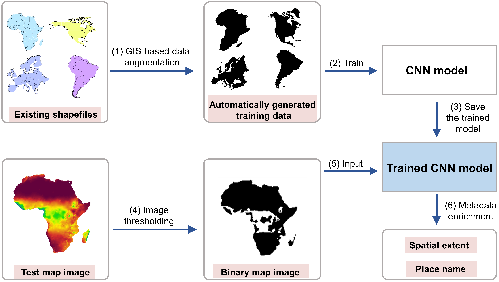
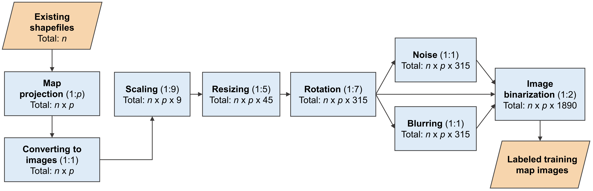
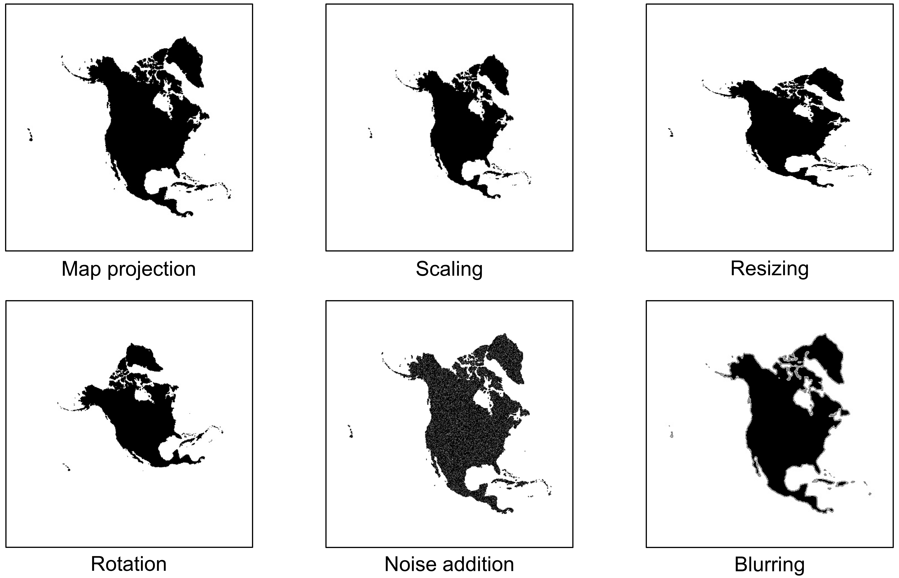
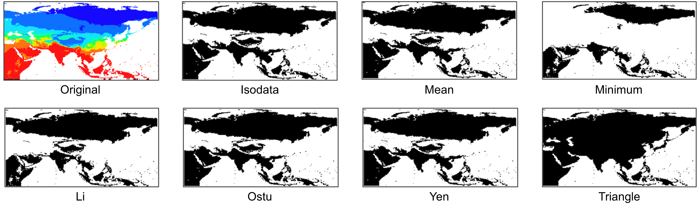

# Enriching the metadata of map images: a deep learning approach with GIS-based data augmentation

### Overall description
Maps in the form of digital images are widely available in geoportals, Web pages, and other data sources. The metadata of map images, such as spatial extents and place names, are critical for their indexing and searching. However, many map images have either mismatched metadata or no metadata at all. Recent developments in deep learning offer new possibilities for enriching the metadata of map images via image-based information extraction. One major challenge of using deep learning models is that they often require large amounts of training data that have to be manually labeled. To address this challenge, this paper presents a deep learning approach with GIS-based data augmentation that can automatically generate labeled training map images from shapefiles  using GIS operations. We utilize such an approach to enrich the metadata of map images by adding spatial extents and place names extracted from map images. We evaluate this  GIS-based data augmentation approach  by using it to train multiple  deep learning models and testing them on two different datasets: a Web Map Service image dataset at the continental scale and an online map image dataset at the state scale. We then discuss the advantages and limitations of the proposed approach.

This repository contains the code and the test map datasets of this work. More details about this work are available in:

<I>Hu, Y., Gui, Z., Wang, J., & Li, M. (2021): Enriching the metadata of map images: a deep learning approach with GIS-based data augmentation, International Journal of Geographical Information Science, in press.</I>  [[PDF]](https://www.acsu.buffalo.edu/~yhu42/)
 

<br />
<br />

<p align="center">

<br />
Figure 1. Overview of the methodological framework for enriching the metadata of map images.
</p>

<br />
<br />

<p align="center">

<br />
Figure 2. GIS-based data augmentation for generating labeled training map images.
</p>

<br />
<br />

<p align="center">

<br />
Figure 3. Results of individual data augmentation strategies applied to the same map.
</p>


<br />
<br />

<p align="center">

<br />
Figure 4. Results of seven different thresholding methods applied to the same map image.
</p>


<br />


### Repository organization

"Training_data" folder: This folder contains the shapefiles used for automatically generating the labeled training data. These shapefiles are inside the subfolder "shapefiles". Other subfolders (e.g., "base_image") in this folder are created and reserved for storing the generated training images and are currently empty.

"Test_data" folder: This folder contains the two datasets of map images for test experiments. 
Continental-level maps retrieved from Web Map Services (WMS):
* 8 classes (Global, Africa, Antarctica, Asia, Europe, North America, Oceania, South America) and one addition "Noise" class
* 100 map images in each category
* Inside the subfolder "/Test_data/Continents"

U.S. state maps retrieved from Google Image Search:
* 50 U.S. states and one addition "Noise" class
* 50 map images in each category
* Inside the subfolder "/Test_data/States"


"DataAugmentation" folder: This folder contains the Python source code of our proposed workflow for automatically generating the labeled training images.

"Image_Thresholding" folder: This folder contains the Python source code for the step of image thresholding on the test maps.

"CNNs" folder: This folder contains the Python source codes for (1) retraining three pre-trained CNN models on the generated training data; (2) evaluating the trained models on the test data sets.


## Automatic training dataset construction
Below, we present the main steps on constructing a labeled training dataset. More detailed comments are in the source code.

### First step: Map projection

This step will perform map projection transformations on the shapefile for each class. The original shapefiles are in WGS84 and are in the subfolder "/Training_data/shapefiles". The projected shapefiles are saved as images in the folder "/Training_data/base_image".

```bash
	python prj_operation.py
```

### Second step: Image augmentation

This step will generate labeled training images via a sequence of operations including scaling, resize, rotation, blurring, adding noise, and binarization. The generated training dataset is saved in "/Training_data/image_set" folder.

```bash
	python Image_augmentation.py
```

## Apply image thresholding on the test maps

This step will convert the RGB test map images into the binary image using the Triangle Thresholding method. Firstly, we need to ensure the continental-level maps are inside the folder "/Test_data/Continents". Then we can run the Thresholding.py script. Once complete, you can check the generated binary map images in the subfolder "/Binary_maps/Continents".

```bash
	python Thresholding.py
```

## Train the CNN models on the augmented data set

### Prepare the pre-trained CNN models

Network|Tensorflow
:---:|:---:
AlexNet | [model (240 MB)](https://www.cs.toronto.edu/~guerzhoy/tf_alexnet/bvlc_alexnet.npy)
Inception-V3 | [model (92 MB)](https://github.com/fchollet/deep-learning-models/releases/download/v0.5/inception_v3_weights_tf_dim_ordering_tf_kernels.h5)
ResNet-50 | [model (103 MB)](https://github.com/fchollet/deep-learning-models/releases/download/v0.2/resnet50_weights_tf_dim_ordering_tf_kernels.h5)

### Train the CNN model

Run the two Python scripts in order:

```bash
     python preprocess.py
     python train.py
```

This process retrains the pre-trained CNN model on the generated training images. The weights of the re-trained model are saved into the "Outputs" folder.


## Test the trained models on test map images

### Default model with SoftMax output

Run prediction.py (inside each CNN model folder) to classify the test maps in the eight classes (the "Noise" class is not included in this part) using the trained CNN model:

```bash
    python prediction.py
```

The outputs include:
(1) The classification accuracy for each class
(2) Error analysis by displaying the incorrect classification distribution on other classes
(3) The overall classification accuracy on the test data set


### Alternative version using OpenMax output

The default model using SoftMax as the last layer cannot reject noise images effectively. Thus, we also implement an improved version using an OpenMax output ([https://arxiv.org/abs/1511.06233](https://arxiv.org/abs/1511.06233)). OpenMax allows rejection of noise map images presented to the CNN models. Here, we provide the code in the "/OpenMax-ResNet" folder to implement a ResNet50-OpenMax model.

To use OpenMax, you do not need to train the model again on the generated training data. You can copy and paste the h5 weights file (from the previously trained ResNet50 model) into the folder "/OpenMax-ResNet/Outputs/". Next, run prediction.py script to run the trained ResNet on the test map images:

```bash
	python prediction.py
```

The outputs include:
(1) "train_scores.npy": the output vectors of fc10 layer (the last fully connected layer of ResNet) when processing the training images
(2) "mavs.npy": the average scores of "train_scores.npy"
(3) "test_scores.npy": the output vectors of fc10 layer (the last fully connected layer of ResNet) when processing the test images

 
 Then run the following codes in the "/OpenMax" folder:

```bash
     python calc_dist.py
     python test_openmax.py
```

The outputs include:
(1) The classification accuracy for each class but will add one "Noise" category
(2) Error analysis by displaying the incorrect classification distribution on other classes
(3) The overall classification accuracy on the test data set


### Project dependencies:

* Python 3.6+
* Keras 2.3.0
* Tensorflow 1.8.0+
* OpenCV-Python
* scikit-image
* GeoPandas
* scipy, joblib, libmr (Optional if to use OpenMax)
* The rest should be installed alongside these major libraries
